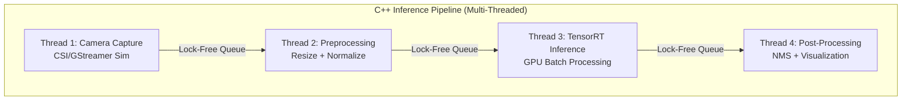

# System Architecture

The Edge AI Object Detection pipeline is built in a multi-stage approach, balancing heavy lifting across threads and effectively utilizing the NVIDIA Jetson Nano architecture.

## Overview

The system consists of two primary components:
1. **Python Tooling (`src/python/`)**: Scripts for training YOLOv8 models, simulating datasets, and exporting models to ONNX and TensorRT `.engine` formats.
2. **C++ Inference Pipeline (`cpp/`)**: A highly optimized, multi-threaded pipeline responsible for running the TensorRT inference process on live video streams or simulations.

## Multi-Threaded C++ Pipeline

The inference pipeline is broken into 4 independent stages, running in separate `std::thread`s. They communicate via `ThreadSafeQueue` buffers.

### Stage 1: Camera Capture
- Interfaces with the CSI camera using GStreamer (`nvarguscamerasrc`), standard USB webcams, or synthetic simulation.
- Pushes `FrameData` to the Capture Queue.

### Stage 2: Preprocessor
- Runs letterbox resizing, BGR to RGB conversion (handled implicitly or through normalisation), scalar normalization, and HWC to CHW transformations.
- Pushes `PreprocessedFrame` to the Preprocess Queue.

### Stage 3: TensorRT Inference
- Central bottleneck of the system.
- Uses `IRuntime`, `IEngine`, and `IExecutionContext`.
- Pushes raw tensor outputs (scaled) wrapped in `InferenceResult` to the Inference Queue.

### Stage 4: Post-Processing
- Reads the raw output tensors.
- Parses YOLO anchor-free bounding boxes.
- Executes Non-Maximum Suppression (NMS).
- Computes metrics (latency, FPS).
- Handles optional OpenCV display (`cv::imshow`).

## Memory Management

### GPU Memory Pool (`gpu_memory_pool.cpp`)
To avoid standard dynamic memory reallocation (`cudaMalloc` / `cudaFree`) on every frame (which is extremely slow), the system allocates a single large block of GPU memory during initialization.

It acts as a bump allocator:
- **Allocation**: Pointer increments by required size.
- **Reset**: Pipeline resets the pointer at the end of every frame boundary, making memory available for the next frame without `cudaFree`.

### Zero-Copy (Jetson Opt.)
On the Jetson, CPU and GPU physically share the same memory chips (Unified Memory). Therefore, when utilizing real TensorRT builds, the engine maps memory as zero-copy buffers, preventing an explicit `cudaMemcpyH2D`.
